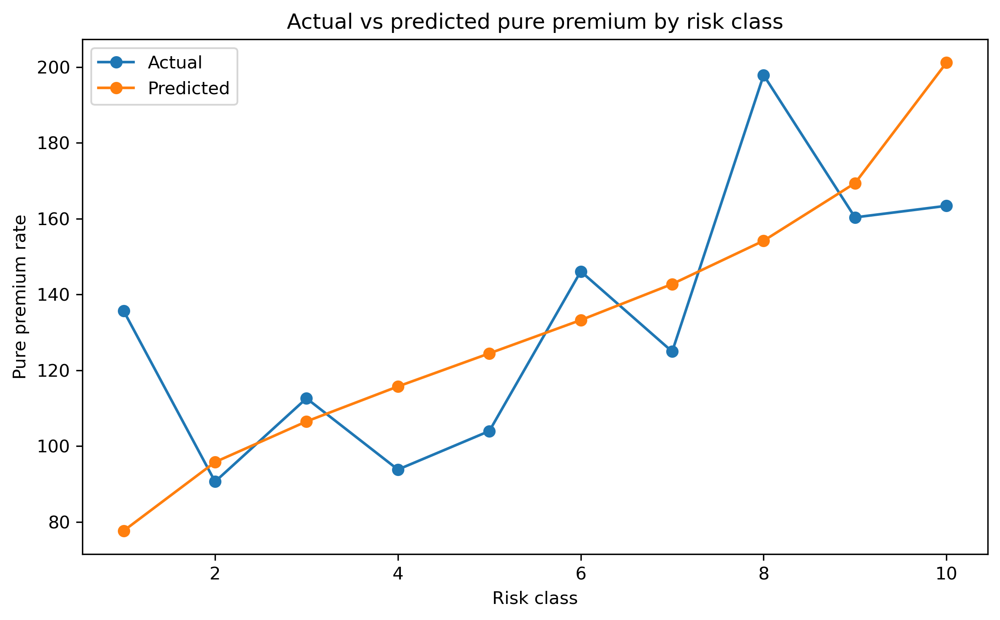
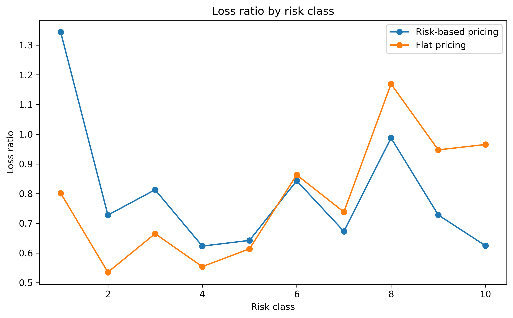

# Pricing and Risk Classification Modeling

This project builds a simple auto insurance pricing model using a frequency-severity approach on the French Motor Third-Party Liability dataset. The goal is to estimate expected loss at the policy level, group policies into risk classes, and compare risk-based pricing against flat portfolio pricing.

## Project objective

In insurance pricing, the main question is not only whether a claim happens, but also how often claims happen and how costly they are when they occur. To reflect that structure, I modeled claim frequency and claim severity separately, then combined them to estimate pure premium.

The main focus of the project is risk classification. Rather than trying to predict every individual policy perfectly, the goal is to build a model that can rank policies into sensible risk groups and support more reasonable class-based pricing.

## Dataset

The project uses the French motor insurance dataset:
- `freMTPL2freq.csv` for policy-level information
- `freMTPL2sev.csv` for claim-level severity information

After merging the two files at the policy level, the data represents around 678,000 policies and about 26,000 claims.

## Method

The workflow is built in a standard frequency-severity pricing structure:

1. Aggregate claim amounts from the severity file to the policy level  
2. Merge the claims information into the policy file  
3. Clean exposure values and cap a few extreme variables  
4. Create pricing targets such as frequency, average claim amount, and pure premium  
5. Split the data into train, validation, and test sets  
6. Fit a Poisson regression model for claim frequency  
7. Fit a Gamma regression model for claim severity  
8. Multiply the two predictions to get predicted pure premium  
9. Rank policies into 10 predicted-risk classes  
10. Apply a simple pricing rule with 25% expense loading and 5% profit loading  
11. Compare class-based pricing against flat portfolio pricing  

## Features used

The model uses a small set of rating variables that are easy to interpret in a student project:
- vehicle age
- driver age
- bonus-malus score
- population density
- vehicle power
- vehicle brand
- fuel type
- area
- region

I kept feature engineering simple so the project stays focused on the pricing logic rather than complicated modeling tricks.

## Model choice

I used:
- **Poisson regression** for claim frequency
- **Gamma regression** for claim severity

This setup is common in actuarial pricing because it separates two different parts of claim cost:
- how often claims happen
- how large claims are when they happen

That makes the final pure premium estimate easier to explain and more aligned with insurance pricing practice.

## Results

The main result is whether the model creates meaningful separation across risk classes.

Key results from the test set:
- Best frequency model alpha: `[fill in]`
- Best severity model alpha: `[fill in]`
- Model premium collected: `[fill in]`
- Flat premium collected: `[fill in]`
- Actual claims: `[fill in]`
- Model profit: `[fill in]`
- Flat profit: `[fill in]`
- Policies flagged as potentially underpriced under flat pricing: `[fill in]`

At the class level, the most important pattern is whether higher predicted-risk classes also show higher actual pure premium. If that pattern is mostly increasing, it suggests the model is ranking policies in a useful way.

## Figures

### Actual vs predicted pure premium by risk class


This figure compares actual and predicted pure premium across the 10 risk classes. A generally increasing pattern supports that the model is separating lower-risk and higher-risk policies in a reasonable way.

### Loss ratio by risk class


This figure compares loss ratios under class-based pricing and flat pricing. The goal is to show that flat pricing can overcharge safer classes and undercharge riskier classes, while risk-based pricing gives a more balanced result across the portfolio.

## What this project shows

This project shows an actuarial pricing workflow from raw insurance data to risk classification and premium setting. It combines data cleaning, GLM modeling, class construction, and pricing interpretation in one end-to-end project.

The strongest part of the project is not claiming perfect prediction. The stronger point is showing a clean and defensible way to rank policies by expected loss and translate that ranking into a simple pricing structure.

## Limitations

There are a few limitations worth noting:
- the severity and frequency files are not perfectly consistent for every policy
- severity is naturally noisy and harder to predict than frequency
- the model only uses the variables available in the dataset
- the pricing loadings are simplified for project purposes and are not company-specific

These limits are normal for a student project and do not take away from the main result, which is building a reasonable and interpretable pricing framework.

## Folder structure

```text
risk-classification-project/
├── data/
│   └── raw/
│       ├── freMTPL2freq.csv
│       └── freMTPL2sev.csv
├── figures/
│   ├── actual_vs_predicted_pure_premium_by_class.png
│   └── loss_ratio_by_risk_class.png
├── notebooks/
│   └── pricing_risk_classification.ipynb
├── src/
└── README.md